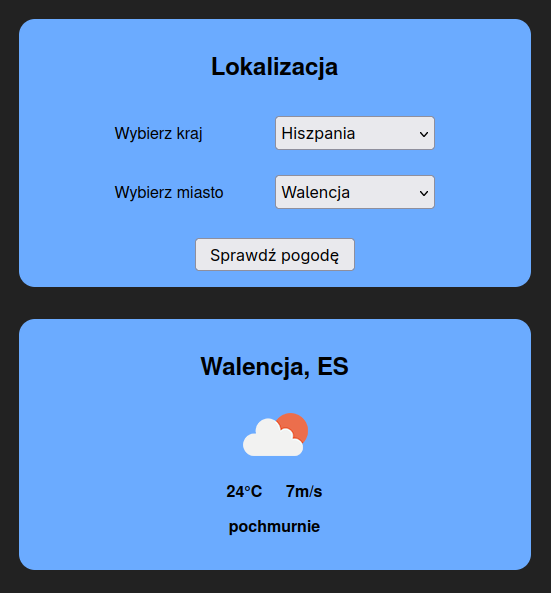

# Serwis pogodowy

Prosty serwis pogodowy korzystający z API udostępnionego przez `https://openweathermap.org/`.

## Docker

1. Budowa obrazu `docker build -t docker-app .`

2. Uruchomienie kontenera
  * Ważne jest utworzenie pliku `.env` w głównym folderze projektu! Powinien on zawierać klucz API do serwisu pogodowego w postaci `WEATHER_API_KEY=<YOUR_API_KEY>`. Wynika to z ochrony klucza przed dostępem publicznym.
  * Polecenie do uruchomienia `docker run -p 3000:3000 --env-file .env -d docker-app`
3. Widok serwisu `http://localhost:3000/`
4. Sprawdzenie ilości warstw
  * wersja podstawowa, mało czytelna `docker history docker-app:latest --no-trunc`
  * wersja usprawniona, na system Linux `docker history docker-app:latest --format "{{.CreatedBy}}" | wc -l`
5. Sprawdzenie stanu aplikacji `docker ps`

_Wszystkie polecenia najbezpieczniej jest wykonywać w folderze głównym aplikacji_

### Wykorzystane technologie:
- HTML/CSS
- JS
  * express
  * axios
  * dotenv
- Docker